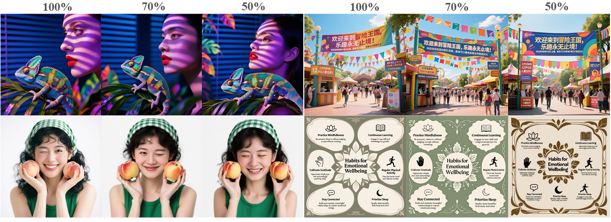
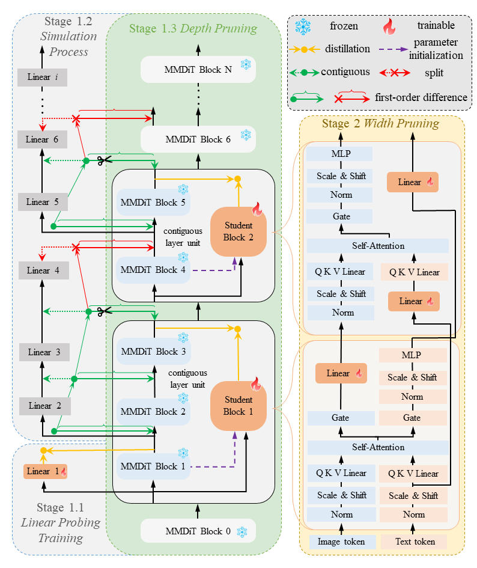

<div align="center">
  <h1>Pluggable Pruning with Contiguous Layer Distillation for Diffusion Transformers</h1>
<a href='https://huggingface.co/collections/OPPOer/qwen-image-pruning'></a>
</div>


## PPCL image generation results
<div align="center">
  
</div>

<div align="center">
  
</div>


# Environment

Prepare the environment, install the required libraries:

    $ conda create --name qwen-image-pruning python==3.11  
    $ conda activate qwen-image-pruning  
    $ pip install -r requirements.txt

# Quick Start

## Qwen-Image-Pruning Inference

``` sh
python script/inference.py # For Qwen-Image-13B Model Inference
python script/inference_12B.py # For Qwen-Image-12B Model Inference
python script/inference_10B.py # For Qwen-Image-10B Model Inference
```

## Qwen-Image-Pruning & Realism-LoRA Inference

``` sh
python script/inference_realism_lora.py
```

## Qwen-Image-Pruning & ControlNet Inference

``` sh
python script/inference_controlnet.py
```

# Full process

<!-- ## Train -->
<!-- We employ the ***Qwen-Image*** model for training, first pruning certain layers and performing distillation (***Depth-wise Pruning***), followed by pruning submodules within some layers and conducting distillation (***Width-wise Pruning***). -->

<!-- The experimental procedure comprises two steps:  
1.The first step employs ***Depth-wise Pruning***, removing specific complete layers from the original model.  
2.The second step implements ***Width-wise Pruning***, building upon Depth-wise Pruning by further replacing certain complex structures within specific layers with linear layers. -->

## Depth-wise Pruning
<!-- The script [`script/train_phase.sh`](./script/train_phase.sh) is used to launch [`script/train_phase.py`](./script/train_phase.py), which trains the ***Qwen-Image*** model into ***diffusion_pytorch_model.bin*** via ***Depth-wise Pruning***. Within the generated ***diffusion_pytorch_model.bin*** file, layers marked for removal are configured to be skipped, while the remaining layers continue to perform regular forward/backward propagation and parameter updates. -->

Run [`script/train_phase.sh`](./script/train_phase.sh) to perform ***Depth-wise Pruning*** on ***Qwen-Image***. The weights of depth-wise pruned student model will be saved in [`output/train_phase`](./output/train_phase).

    accelerate launch --config_file "accelerate_config.yaml" \
        --machine_rank 0 \
        --main_process_ip "127.0.0.1" \
        --main_process_port 29001 \
        --num_machines 1 \
        --num_processes 1 \
        script/train_phase.py \
        --webdataset_base_urls "text2img_data/text_rendering_space_qwen_image/*/*" \
        --num_workers 1 \
        --batch_size 1 \
        --shard_width 5 \
        --train_split 1.0 \
        --val_split 0.0 \
        --test_split 0.0 \
        --gradient_accumulation_steps 1 \
        --max_train_steps 20000 \
        --learning_rate 1e-05 \
        --lr_scheduler "cosine" \
        --lr_warmup_steps 16 \
        --mixed_precision "bf16" \
        --checkpointing_steps 1000 \
        --output_dir "output/train_phase" \
        --max_grad_norm 1e+30 \
        --checkpoints_total_limit 5 \
        --use_8bit_adam \
        --teacher "/mnt/workspace/group/models/Qwen-Image/Qwen-Image" \
        --layer_index "[[3,4],[5,7],[8,10],[11,12],[15,24],[25,27],[29,30],[42,43],[45,47],[48,49],[52,53],[54,55],[56,57]]" \

- ***--teacher:*** *Path to original model*
- ***--layer_index:*** *Skipped layers during depth-wise pruning*

## Width-wise Pruning
<!-- The script [`script/train_phase_ehs_ffn_proj_initlinear.sh`](./script/train_phase_ehs_ffn_proj_initlinear.sh) is used to launch [`script/train_phase_ehs_ffn_proj_initlinear.py`](./script/train_phase_ehs_ffn_proj_initlinear.py), which generate a new ***diffusion_pytorch_model.bin*** through width pruning. In the new "diffusion_pytorch_model.bin" file, the transformation of the corresponding structures to linear is completed. -->

Run [`script/train_phase_ehs_ffn_proj_initlinear.sh`](./script/train_phase_ehs_ffn_proj_initlinear.sh) to load the weights of the depth-wise pruned student model in [`output/train_phase`](./output/train_phase) and further perform ***Width-wise Pruning***. The weights of width-wise pruned student model will be saved in [`output/train_phase_ehs_ffn_proj_initlinear`](./output/train_phase_ehs_ffn_proj_initlinear).

    accelerate launch --config_file "accelerate_config.yaml" \
        --machine_rank 0 \
        --main_process_ip "127.0.0.1" \
        --main_process_port 29001 \
        --num_machines 1 \
        --num_processes 1 \
        script/train_phase_ehs_ffn_proj_initlinear.py \
        --webdataset_base_urls "text2img_data/qwen_image_bench_40/*/*" "text2img_data/qwen_image_bench1/*/*" \
        --num_workers 1 \
        --batch_size 4 \
        --shard_width 5 \
        --train_split 1.0 \
        --val_split 0.0 \
        --test_split 0.0 \
        --gradient_accumulation_steps 1 \
        --max_train_steps 20000 \
        --learning_rate 1e-05 \
        --lr_scheduler "cosine" \
        --lr_warmup_steps 32 \
        --mixed_precision "bf16" \
        --checkpointing_steps 1 \
        --output_dir "output/train_phase_ehs_ffn_proj_initlinear" \
        --max_grad_norm 1e+30 \
        --checkpoints_total_limit 5 \
        --use_8bit_adam \
        --transformer_distill_path "output/train_phase/10/diffusion_pytorch_model.bin" \
        --layer_indexs "[[3,4],[5,7],[8,10],[11,12],[15,24],[25,27],[29,30],[42,43],[45,47],[48,49],[52,53],[54,55],[56,57]]" \
        --ehs_same "[[13,14],[31,32],[33,34],[36,37],[40,41],[50,59]]" \
        --teacher "/mnt/workspace/group/models/Qwen-Image/Qwen-Image" \

- ***--transformer_distill_path:*** *Trained model in depth-wise pruning*
- ***--ehs_same:*** *Layers transformed during width-wise pruning*

<!-- # Inference
Before inference, the trained model file is packaged into a pipeline, and then the pipeline is called to perform the inference. -->

## Model transformation
<!-- The script [`script/pipeline_save.sh`](./script/pipeline_save.sh) is used to launch [`script/pipeline_save.py`](./script/pipeline_save.py), which package ***diffusion_pytorch_model.bin*** into ***Qwen-Image-Pruning***. The ***Qwen-Image-Pruning*** folder could be used for model loading during the inference process. -->

Run [`script/pipeline_save.sh`](./script/pipeline_save.sh) to load the weights of the pruned student model in [`output/train_phase_ehs_ffn_proj_initlinear`](./output/train_phase_ehs_ffn_proj_initlinear) and save it as a ***pipeline***. The pipeline will be saved in [`output/pipeline_save`](./output/pipeline_save).

    python script/pipeline_save.py \
        --checkpoint_dir "output/train_phase_ehs_ffn_proj_initlinear/10" \
        --model_name "/mnt/workspace/group/models/Qwen-Image/Qwen-Image" \
        --save_dir "output/pipeline_save" \
        --layer_indexs '[[3,4],[5,7],[8,10],[11,12],[15,24],[25,27],[29,30],[42,43],[45,47],[48,49],[52,53],[54,55],[56,57]]' \
        --ehs_same '[[13,14],[31,32],[33,34],[36,37],[40,41],[50,59]]' \
        --ehs_same_indexs 3 4 5 \
        --ffn_block_indexs 2 58 59 \
        --removed_block \
        --use_ehs_proj 1 \

- ***--checkpoint_dir:*** *Path to the model checkpoint generated by width pruning training.*
- ***--model_name:*** *Path to the original model.*
- ***--layer_indexs:*** *Indices of the layers selected for pruning in depth pruning.*
- ***--ehs_same:*** *Indices of the layers selected for pruning in width pruning.*
- ***--ehs_same_indexs:*** *Indices of the specific, confirmed layers to be removed from the set of all skipped complete layers in width pruning.*
- ***--ffn_block_indexs:*** *Indices of the FFN blocks that were skipped when loading the teacher model.*
- ***--removed_block:*** *The complete layers that were skipped during the teacher model loading process | In this project, this parameter has already been confirmed during the depth pruning training phase and is set to empty by default here.*
- ***--use_ehs_proj:*** *Flag to enable/disable the linear projection module in width pruning | If set to 0, the corresponding linear tensors are also skipped.*


## Inference
<!-- The script [`script/inference_txt_ffn.sh`](./script/inference_txt_ffn.sh) is used to launch [`script/inference_txt_ffn.py`](./script/inference_txt_ffn.py) for performing inference. -->

Run [`script/inference_txt_ffn.sh`](./script/inference_txt_ffn.sh) to load the pipeline  and  perform inference.

    python script/inference_txt_ffn.py \
        --width 1328 \
        --height 1328 \
        --model_name "output/pipeline_save/Qwen-Image-Pruning" \
        --save_path "output/qwen-image-pruning" \

- ***--width:*** *Specifies the width (in pixels) of the picture to be generated.*
- ***--height:*** *Specifies the height (in pixels) of the picture to be generated*
- ***--model_name:*** *Path to the model that generated in model transformation*
- ***--save_path:*** *Directory path where the generated pictures will be saved.*


## Citation

🌟 If you find our work helpful, please consider citing our paper and leaving valuable stars

```
@misc{ma2025pluggablepruningcontiguouslayer,
      title={Pluggable Pruning with Contiguous Layer Distillation for Diffusion Transformers}, 
      author={Jian Ma and Qirong Peng and Xujie Zhu and Peixing Xie and Chen Chen and Haonan Lu},
      year={2025},
      eprint={2511.16156},
      archivePrefix={arXiv},
      primaryClass={cs.CV},
      url={https://arxiv.org/abs/2511.16156}, 
}
```

